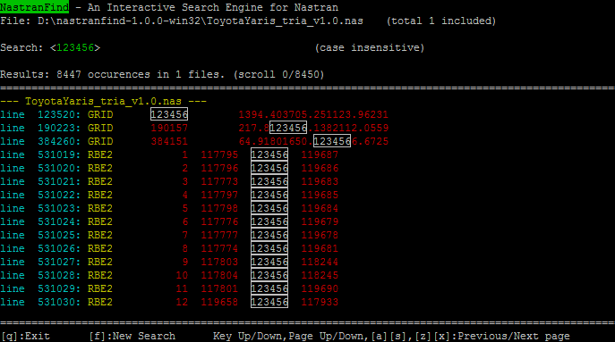

# Nastranfind

Nastranfind is a solution for browsing [Nastran](https://en.wikipedia.org/wiki/Nastran "NASA Nastran") input deck files for Windows, Mac OS X and Unix. 

Its core is developed in C++, based on the [Curses](https://en.wikipedia.org/wiki/Curses_(programming_library) "Curses (programming library)") library. 

## Download

Go to the [download](https://github.com/setvisible/nastran-find/releases "Download") page

## Screenshots

Main window, looking for `123456` in the Toyota Yaris model. It found 8447 occurrences:

## Features

Nastranfind performs a **case-insensitive** text research over **the whole 'INCLUDE' hierarchy** of a given [FEA](https://en.wikipedia.org/wiki/Finite_element_analysis "Finite Element Analysis (FEA)") model.

It returns results for the _whole_ FEA, not limited to a given file and/or directory.

### Capabilities

 - Nastranfind can find the exact location of a given *Nastran deck entry*
 - Nastranfind can check the connections between *deck entries*, as well as the missing or duplicate entries
 - Nastranfind can verify if the **INCLUDEs** are correctly linked
 - Nastranfind can compare two FE models (require to open two consoles)

...and it does these nice things with **very large FE Models** that contain 1,000,000 elements and more.

## Dependencies

### On Unix / Mac OS X

 - First sign into the administrative (root) account by running su or sudo:

         $ su

 - Install [NCurses](http://www.gnu.org/software/ncurses/ncurses.html "Go to NCurses Website"):

         $ apt-get update
         $ apt-get install libncurses5-dev
         $ whereis ncurses
         ncurses: /usr/include/ncurses.h

### On Windows

Install [PDCurses](http://pdcurses.sourceforge.net/ "Go to PDCurses Website"):

 - Win9x/Me/NT/2k/XP/Vista --> build the directory `win32`
 - Win7/Win8/Win10 --> build the directory `win32a`

## Compilation

1. Download `nastranfind-src.tar.gz`.

2. Unzip:

        $ tar zxvf nastranfind-src.tar.gz
        $ cd nastranfind-src/

3. Build with Qt

     Compile and run `nastranfind.pro`.

4. Build with CMake

     - On Unix / Mac OS X

            $ mkdir -p build
            $ cd build/
            $ cmake ..
            $ make -j
            $ make install

     - On Windows (MinGW)

            > mkdir -p build
            > cd build/
            > cmake .. -G "MinGW Makefiles"
            > make -j

     - On Windows (MSVC)

            > mkdir -p build
            > cd build/
            > cmake .. -G "Visual Studio 14 2015"
            > start .

         Then, double click the Visual Studio project (vcxproj).

## Usage

On Unix / Mac OS X 

    $ ./nastranfind MyFile.bdf

On Windows

    > nastranfind.exe MyFile.bdf

__Commands:__

 - Press `F` to find a word
 - Press `A` `S` `Z` `X` or the keypad to browse the results
 - Press `Q` to quit

## License

The code is released under the GNU **LGPLv3** open source license. 

[https://www.gnu.org/licenses/lgpl-3.0.en.html](https://www.gnu.org/licenses/lgpl-3.0.en.html)
